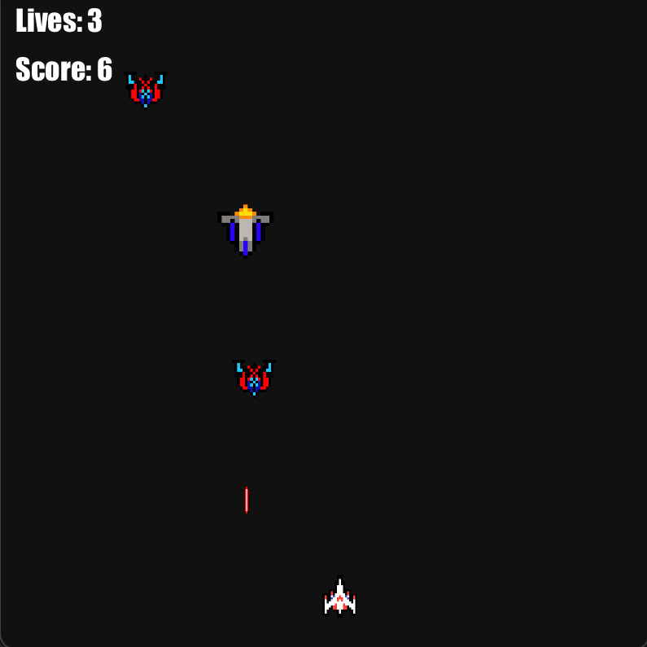
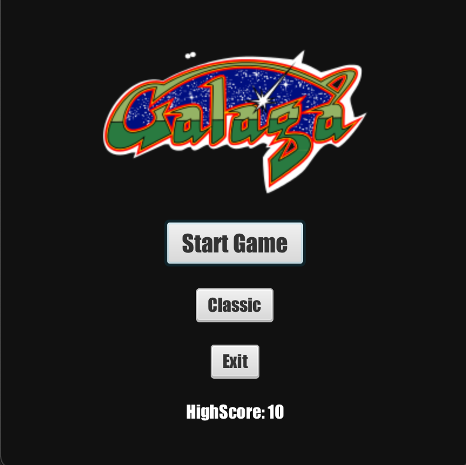
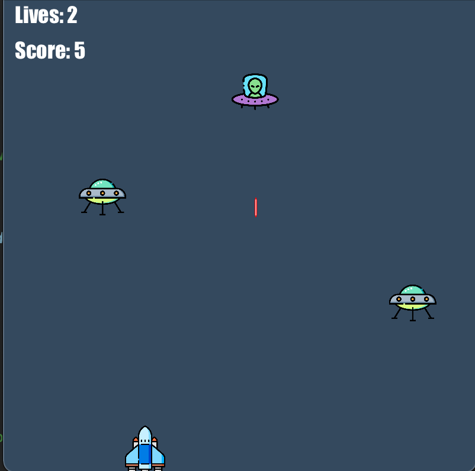
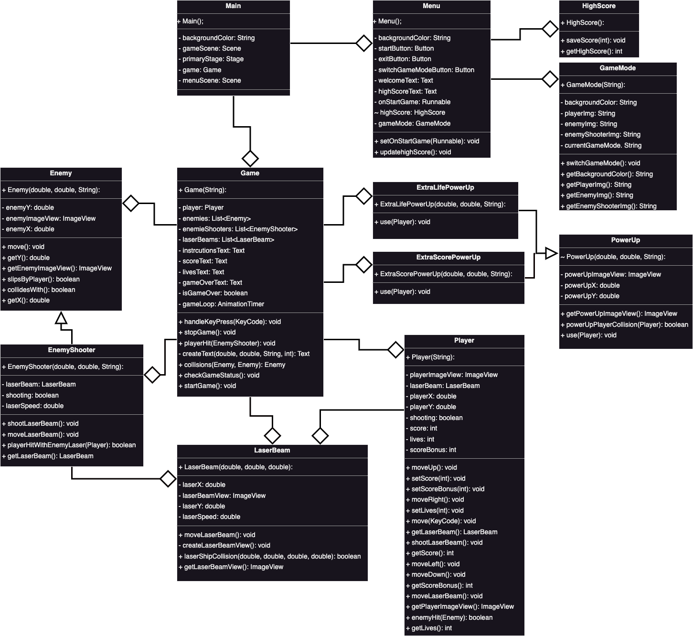

# The Mission
Earth is about to be invaded by alien an enemies. 
Protect our home and join the battle in outer space against these extra terrestrial foes.
The worlds faith is in your hands!
  

## Rules
- You have three lives.
- Every terminated enemy accumulates points.
- PowerUps are drifting around in outer space, collect and be rewarded.
- Enemy emie ships that slips by will cost one life.
- Collisions with enemy ships will cost one life.
- Collisions with enemy lasers will cost one life.
- Stay alive and take down as many enemy ships as you can!
  

### Bonus
Extra map included!
  

# The Project
This game was built on java and the graphic javafx library.

## UML
