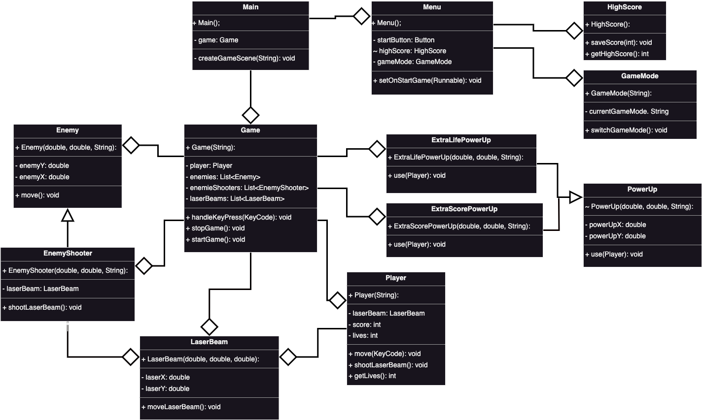

# galaga

Galaga spel i Java och JavaFX

#### game
- spelare
- fiender
- bana

#### spelare
- liv: 3
- poäng: tid / nedkjutna fiender
- skjuta
- rörelse: tempo

#### fiender
- typ: kan skjuta / röra sig snabbt
- hp: hur många skott krävs
- rörelse: tempo, directions
- kommer in från vilket håll?
- formation ?

#### banor:
- backgrund
- powerups
- andra föremål

#### meny
- nytt spel
- highscores
- avsluta

#### packet:
- graphic
- logic